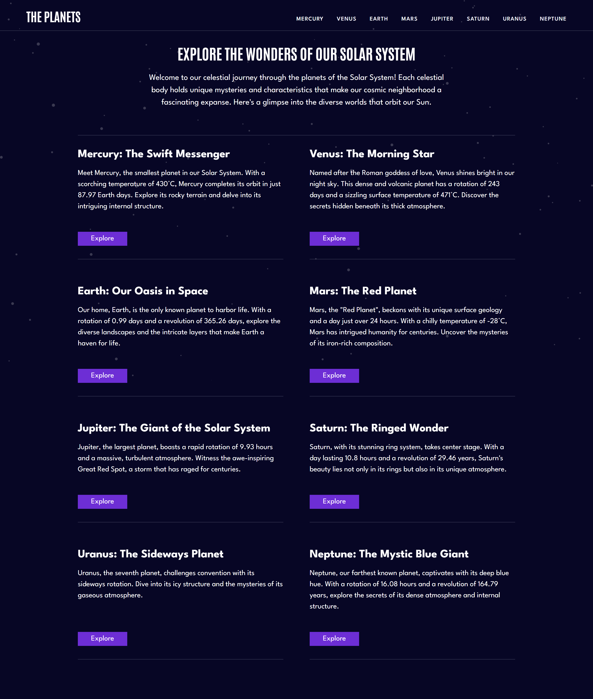
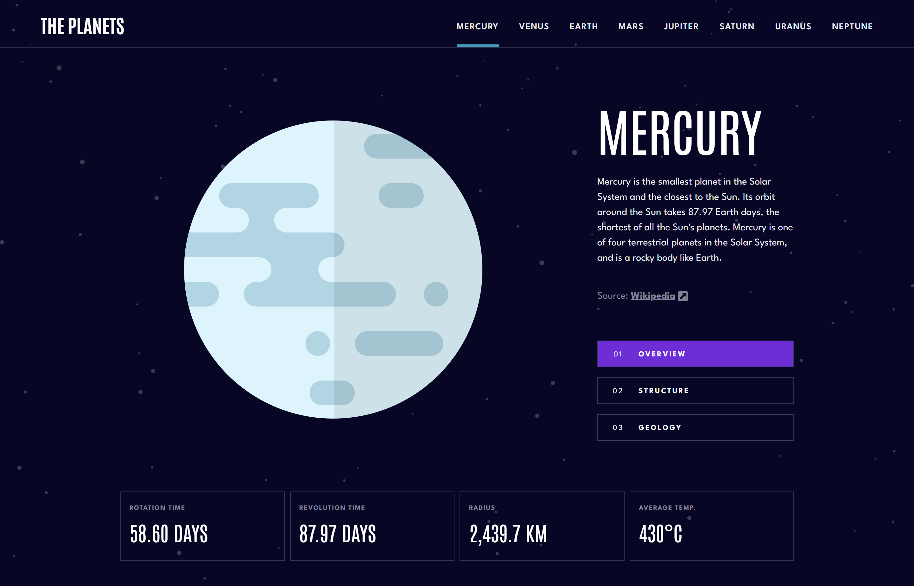

# Planets Fact Site 

This project is my solution to the Planets Fact Site challenge on Frontend Mentor. 

## Table of Contents

- Screenshot:
- Overview: 
    - The challenge
- Links
- My process
    - Built with
    - What I learned
    - Continued development
    - Useful resources
- Author

## Screenshot

## Overview

### The challenge

Users should be able to:

- View the optimal layout for the app depending on their device's screen size
- See hover states for all interactive elements on the page
- View each planet page and toggle between "Overview", "Internal Structure", and "Surface Geology"

## Links

- [Solution URL](https://github.com/TerminalEagle/planets-fact-site)
- [Live Site URL](https://planets-fact-site-website.netlify.app/mercury)

## My process

### Built with

* Semantic HTML5 markup
* SASS/SCSS
* Flexbox
* CSS Grid
* Mobile-first workflow
* React: [https://reactjs.org/](https://reactjs.org/) - JS library
* Next.js: [https://nextjs.org/](https://nextjs.org/) - React framework

### What I learned

This project challenged my layout skills, especially for a multipage website. I specifically gained valuable experience with:

* **Dynamic Routing in Next.js:**  Implementing dynamic routes to create adaptable planet pages.

### Continued development

I want to explore more advanced applications of dynamic routing and further enhance my understanding of  Next.js data fetching methods.

### Useful resources

* **Dynamic Routes:** [https://nextjs.org/docs/routing/dynamic-routes](https://nextjs.org/docs/routing/dynamic-routes)
* **Data fetching-overview:** [https://nextjs.org/docs/basic-features/data-fetching/overview](https://nextjs.org/docs/basic-features/data-fetching/overview)
* **Get server-side-props:**  [https://nextjs.org/docs/basic-features/data-fetching/get-server-side-props](https://nextjs.org/docs/basic-features/data-fetching/get-server-side-props)

## Author

- Frontend Mentor - [@TerminalEagle](https://www.frontendmentor.io/profile/TerminalEagle) 
